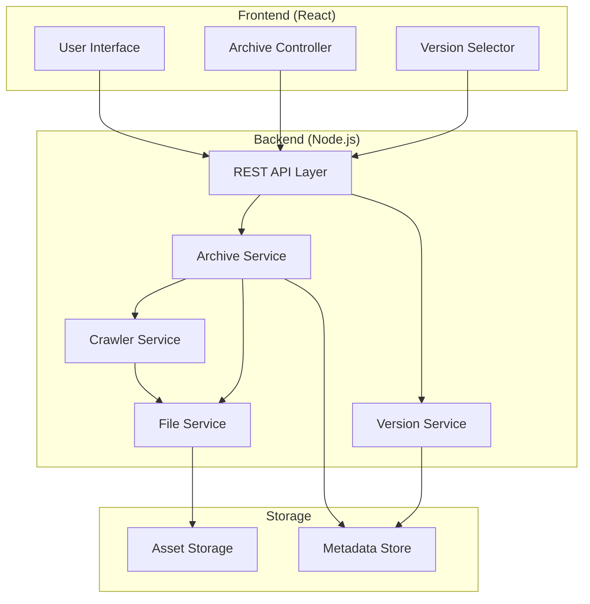

# Design Document

## Overview

The web archiving tool is designed as a full-stack application with a React frontend and a Node.js backend. The system captures complete website snapshots by recursively crawling same-domain pages and downloading all associated assets. The architecture emphasizes modularity, scalability, and data integrity while maintaining simplicity for the initial implementation.

## Architecture

### High-Level Architecture



### Technology Stack

**Frontend:**
- React 18 with functional components and hooks
- Axios for HTTP requests
- React Router for navigation
- CSS Modules for styling

**Backend:**
- Node.js with Express.js framework
- Puppeteer for web scraping and asset capture
- Cheerio for HTML parsing and link extraction
- File system for storage (with database migration path)

**Storage:**
- JSON files for metadata (initial implementation)
- File system hierarchy for archived assets
- Future migration path to PostgreSQL/MongoDB

## Components and Interfaces

### Frontend Components

#### ArchiveForm Component
```typescript
interface ArchiveFormProps {
  onSubmit: (url: string) => void;
  isLoading: boolean;
}
```
- Handles URL input validation
- Displays archiving progress
- Shows error states

#### ArchiveList Component
```typescript
interface Archive {
  id: string;
  url: string;
  timestamp: Date;
  status: 'completed' | 'in_progress' | 'failed';
  pageCount: number;
}

interface ArchiveListProps {
  archives: Archive[];
  onSelectArchive: (archiveId: string) => void;
  onReArchive: (url: string) => void;
}
```
- Displays chronological list of archives
- Provides re-archive functionality
- Shows archive metadata

#### ArchivedViewer Component
```typescript
interface ArchivedViewerProps {
  archiveId: string;
  initialPath?: string;
}
```
- Renders archived content in iframe
- Handles navigation within archived site
- Provides archive context indicators

### Backend Services

#### Archive Service
```typescript
interface ArchiveService {
  createArchive(url: string): Promise<Archive>;
  getArchives(): Promise<Archive[]>;
  getArchive(id: string): Promise<Archive>;
  deleteArchive(id: string): Promise<void>;
}
```
- Orchestrates the archiving process
- Manages archive metadata
- Handles concurrent archiving operations

#### Crawler Service
```typescript
interface CrawlerOptions {
  maxDepth: number;
  maxPages: number;
  timeout: number;
  respectRobots: boolean;
}

interface CrawlerService {
  crawlSite(url: string, options: CrawlerOptions): Promise<CrawlResult>;
  extractLinks(html: string, baseUrl: string): string[];
  isValidUrl(url: string, domain: string): boolean;
}
```
- Discovers and crawls same-domain pages
- Extracts and validates links
- Implements crawl depth and breadth limits

#### File Service
```typescript
interface FileService {
  saveAsset(url: string, content: Buffer, archiveId: string): Promise<string>;
  saveHtml(content: string, path: string, archiveId: string): Promise<string>;
  getAsset(path: string, archiveId: string): Promise<Buffer>;
  rewriteUrls(html: string, baseUrl: string, archiveId: string): string;
}
```
- Manages file storage and organization
- Handles URL rewriting for archived content
- Maintains asset integrity

## Data Models

### Archive Model
```typescript
interface Archive {
  id: string;
  url: string;
  domain: string;
  timestamp: Date;
  status: ArchiveStatus;
  metadata: {
    pageCount: number;
    assetCount: number;
    totalSize: number;
    crawlDuration: number;
  };
  pages: ArchivedPage[];
  errors: ArchiveError[];
}

enum ArchiveStatus {
  IN_PROGRESS = 'in_progress',
  COMPLETED = 'completed',
  FAILED = 'failed',
  PARTIAL = 'partial'
}
```

### Archived Page Model
```typescript
interface ArchivedPage {
  url: string;
  path: string;
  title: string;
  timestamp: Date;
  assets: Asset[];
  links: string[];
}

interface Asset {
  originalUrl: string;
  localPath: string;
  type: AssetType;
  size: number;
  contentType: string;
}

enum AssetType {
  HTML = 'html',
  CSS = 'css',
  JAVASCRIPT = 'javascript',
  IMAGE = 'image',
  FONT = 'font',
  OTHER = 'other'
}
```

### Storage Structure
```
archives/
├── metadata.json
└── {archive-id}/
    ├── manifest.json
    ├── pages/
    │   ├── index.html
    │   ├── about/
    │   │   └── index.html
    │   └── contact/
    │       └── index.html
    └── assets/
        ├── css/
        ├── js/
        ├── images/
        └── fonts/
```

## Error Handling

### Error Categories
1. **Network Errors**: Timeouts, DNS failures, connection refused
2. **Content Errors**: Invalid HTML, missing assets, encoding issues
3. **Storage Errors**: Disk space, permission issues, file corruption
4. **Validation Errors**: Invalid URLs, unsupported content types

### Error Recovery Strategies
- **Retry Logic**: Exponential backoff for transient network errors
- **Partial Success**: Continue archiving available content when some assets fail
- **Graceful Degradation**: Serve archived content even with missing assets
- **User Feedback**: Clear error messages with actionable guidance

### Error Logging
```typescript
interface ArchiveError {
  timestamp: Date;
  type: ErrorType;
  message: string;
  url?: string;
  stack?: string;
  recoverable: boolean;
}
```

## Testing Strategy

### Unit Testing
- **Frontend**: Jest + React Testing Library for component testing
- **Backend**: Jest for service and utility function testing
- **Coverage Target**: 80% code coverage minimum

### Integration Testing
- **API Testing**: Supertest for endpoint testing
- **Crawler Testing**: Mock HTTP responses for consistent testing
- **File System Testing**: Temporary directories for isolated tests

### End-to-End Testing
- **User Workflows**: Cypress for complete user journey testing
- **Archive Integrity**: Verify archived sites render correctly
- **Performance Testing**: Load testing for concurrent archiving

### Test Data Management
```typescript
interface TestFixtures {
  sampleSites: {
    simple: string;
    complex: string;
    withAssets: string;
  };
  mockResponses: MockResponse[];
}
```

## Performance Considerations

### Crawling Optimization
- **Concurrent Requests**: Limit concurrent connections (default: 5)
- **Request Throttling**: Respect server rate limits
- **Caching**: Cache DNS lookups and HTTP responses
- **Resource Limits**: Set maximum file sizes and crawl depth

### Storage Optimization
- **Asset Deduplication**: Store identical assets once per archive
- **Compression**: Gzip HTML and text assets
- **Lazy Loading**: Load archived content on demand
- **Cleanup**: Automatic cleanup of failed/incomplete archives

### Frontend Performance
- **Virtual Scrolling**: For large archive lists
- **Progressive Loading**: Load archive metadata incrementally
- **Caching**: Browser caching for archived assets
- **Code Splitting**: Lazy load archive viewer components

## Security Considerations

### Input Validation
- URL validation and sanitization
- Content-Type verification
- File size limits
- Path traversal prevention

### Content Security
- Sandbox archived JavaScript execution
- Strip potentially malicious content
- Validate HTML structure
- Prevent XSS in archived content

### Access Control
- Rate limiting for archive creation
- Storage quota management
- Archive access permissions (future enhancement)

## Scalability Considerations

### Horizontal Scaling
- **Stateless Services**: Design for multiple backend instances
- **Queue System**: Redis/RabbitMQ for archive job management
- **Load Balancing**: Distribute crawling load across workers

### Database Migration Path
- **Metadata Storage**: PostgreSQL for complex queries
- **Asset Storage**: S3-compatible storage for large files
- **Search Indexing**: Elasticsearch for archive content search

### Monitoring and Observability
- **Metrics**: Archive success rates, crawl performance
- **Logging**: Structured logging with correlation IDs
- **Health Checks**: Service availability monitoring
- **Alerting**: Failed archive notifications